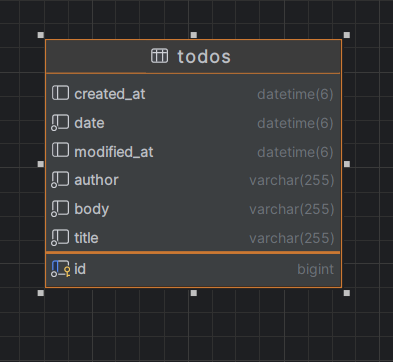
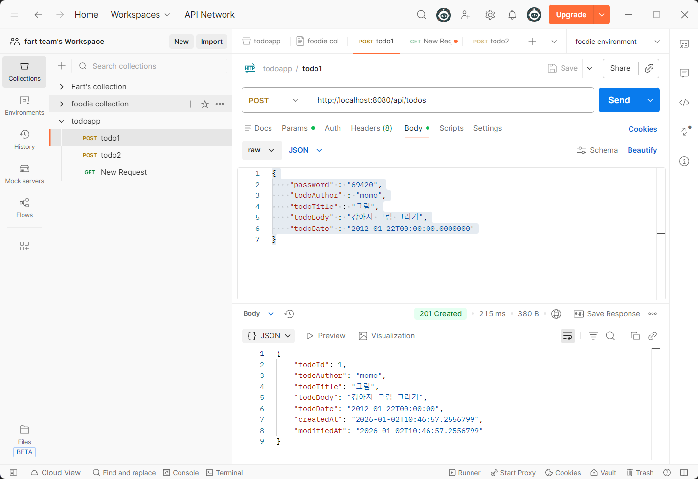
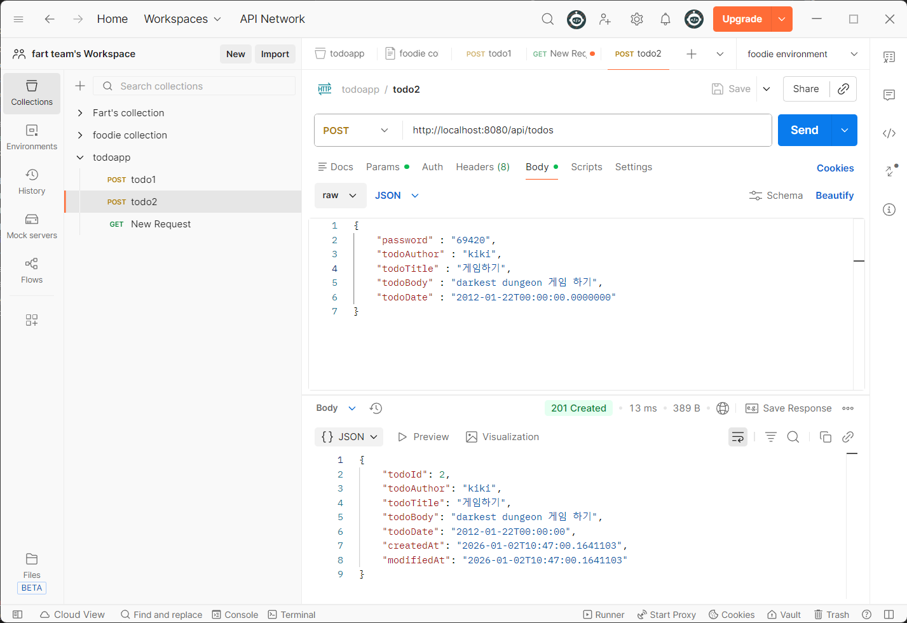
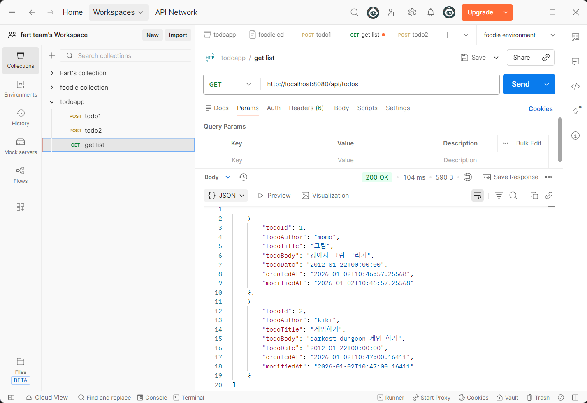

# Sparta TODO-app Project

## 프로젝트 개요
- 프로젝트 목적: Spring공부를 위한 간단한 TODO app

## 기술 스택
- Language: Java 17
- IDE: IntelliJ IDEA

## 빌드

빌드를 위해서는 JDK 17이 필요합니다.

이 명령어를 입력해 주세요
```
gradlew build
```

리눅스에서는 이렇게 해야 합니다.
```
./gradlew build
```

## 실행
그냥 돌아가는 것만 보고 싶으시다면 이 명령어를 쓰세요
```
gradlew bootRun
```

비밀번호는 69420로 고정되어 있습니다 (아직은).

기본적으로 실제 DB를 쓰지 않고 [H2](https://www.h2database.com/html/main.html)라는 embedded 데이터베이스를 이용하여 파일이 아닌 메모리 상으로만 저장하도록 설정하게 되어 있습니다. 

다른 설정을 쓰고 싶으시다면 이 방법을 쓰세요(windows 예시). mysql 설정 파일 예시는 application-template.properties에 있습니다.

```
gradlew bootRun --args="--spring.config.location=file:.\\application-template.properties"
```

## Formatter

Formatter는 [google-java-format](https://github.com/google/google-java-format)을 사용합니다. 저는 간단한 batch파일을 이용해서 포맷합니다.

(fmt.bat 참고)

## ERD



# API 명세서

## /api/todos

### `GET` 모든 todo 반환

### RESPONSE 200
```
[
    {
        "todoId" : "1",
        "todoAuthor" : "momo",
        "todoTitle" : "햄버거 사기",
        "todoBody" : "맥도날드 가서 햄버거 사기",
        "todoDate" : "2000-01-22T00:00:00.0000000",

        "createdAt" : "2000-01-22T00:00:00.0000000", 
        "modifiedAt" : "2000-01-22T00:00:00.0000000"
    },
    {
        "todoAuthor" : "kiki",
        "todoId" : "2",
        "todoTitle" : "momo 햄버거 뺏기",
        "todoBody" : "momo의 맛있는 햄버거 뺏어먹기",
        "todoDate" : "2000-01-22T00:00:00.0000000",

        "createdAt" : "2000-01-22T00:00:00.0000000", 
        "modifiedAt" : "2000-01-22T00:00:00.0000000"
    }
]
```

### `POST` todo 추가

### REQUEST
```
{
    "password" : "69420",

    "todoAuthor" : "momo",
    "todoTitle" : "햄버거 사기",
    "todoBody" : "맥도날드 가서 햄버거 사기",
    "todoDate" : "2000-01-22T00:00:00.0000000"
}
```

### RESPONSE 201
```
{
    "todoId" : "1",
    "todoAuthor" : "momo",
    "todoTitle" : "햄버거 사기",
    "todoBody" : "맥도날드 가서 햄버거 사기",
    "todoDate" : "2000-01-22T00:00:00.0000000",

    "createdAt" : "2000-01-22T00:00:00.0000000", 
    "modifiedAt" : "2000-01-22T00:00:00.0000000"
}
```

## /api/todos?author={author-name}

### `GET` 해당 작성자의 todo 반환

### RESPONSE 200
```
[
    {
        "todoId" : "1",
        "todoAuthor" : "momo",
        "todoTitle" : "햄버거 사기",
        "todoBody" : "맥도날드 가서 햄버거 사기",
        "todoDate" : "2000-01-22T00:00:00.0000000",

        "createdAt" : "2000-01-22T00:00:00.0000000", 
        "modifiedAt" : "2000-01-22T00:00:00.0000000"
    },
]
```

## /api/todos/{todo-id}

### `GET` 해당 todo-id의 todo 반환

### RESPONSE 200
```
{
    "todoId" : "1",
    "todoAuthor" : "momo",
    "todoTitle" : "햄버거 사기",
    "todoBody" : "맥도날드 가서 햄버거 사기",
    "todoDate" : "2000-01-22T00:00:00.0000000",

    "createdAt" : "2000-01-22T00:00:00.0000000", 
    "modifiedAt" : "2000-01-22T00:00:00.0000000"
},
```

### `PUT` 해당 todo-id의 todo 수정

### REQUEST
```
{
    "password" : "69420",

    "todoAuthor" : "momo",
    "todoTitle" : "햄버거 사기",
},
```

### RESPONSE 200
```
{
    "todoId" : "1",
    "todoAuthor" : "momo",
    "todoTitle" : "햄버거 사기",
    "todoBody" : "맥도날드 가서 햄버거 사기",
    "todoDate" : "2000-01-22T00:00:00.0000000",

    "createdAt" : "2000-01-22T00:00:00.0000000", 
    "modifiedAt" : "2000-01-22T00:00:00.0000000"
},
```

### `DELETE` 해당 todo-id의 todo 삭제

### REQUEST
```
{
    "password" : "69420",
},
```

### RESPONSE 204

## POSTMAN 실행 결과들





## git convention

- FEAT:     feature 추가
- FIX:      버그 수정
- REFACTOR: refactoring
- MISC:     기타

## 3 Layer Achitecture가 필요한 이유

Controller, Service, Repository가 역활을 공유하기에는 책임이 너무 다르기 때문입니다.

Controller는 유저한테 응답을 돌려주는 역활을 하고
Service는 비지니스 로직을 담당하고
Repository는 정보를 저장하는 역활을 담당합니다.

## @RequestParam, @PathVariable, @RequestBody 설명

- @RequestParam : url의 parameter를(www.google.come?key=value) argument에 적힌 타입으로 반환해 넣어줍니다.
- @PathVariable : api URL의 path 부분을 argument에 적힌 타입으로 반환해 넣어줍니다.
- @RequestBody : request의 body를 argument에 적힌 타입으로 반환해 넣어줍니다.

